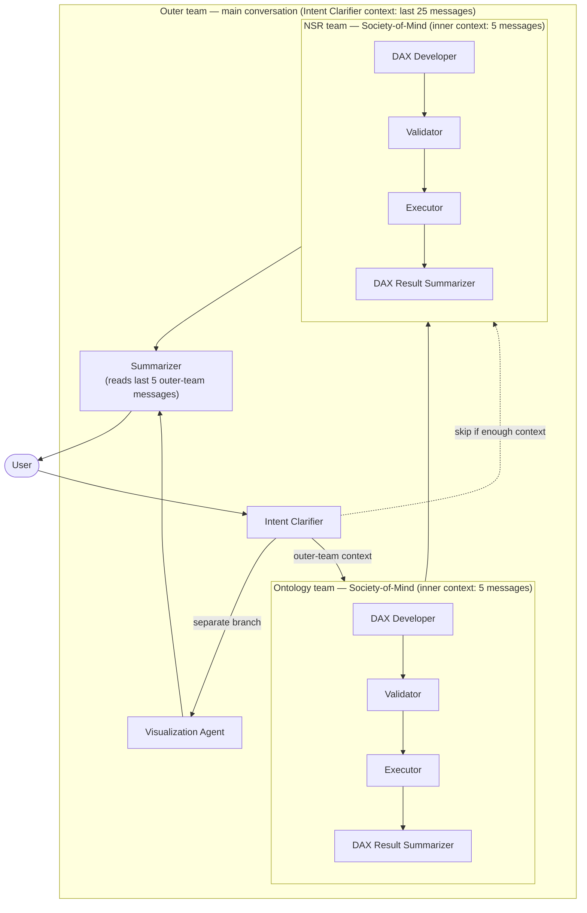

# Context Flow

This document describes **how context flows between agents** in the NSR multi-agent
system: what each agent can and cannot see, what crosses the boundary between the main
conversation and the Society-of-Mind sub-teams, and how many messages each layer retains.

The individual agent prompt files in [`prompts/nsr_system/`](../prompts/nsr_system/)
describe each agent's *behavior*. This document describes the *context boundaries* that
sit between them — information that is otherwise implicit in the orchestration design.

## Teams

The system is organized into two layers of teams.

### Outer team (main conversation)

The outer team is the main conversation. Its members are:

- **Intent Clarifier** — entry point; interprets and governs user intent.
- **Ontology team** — a Society-of-Mind agent (see below).
- **NSR team** — a Society-of-Mind agent (see below).
- **Visualization Agent** — renders the executed dataset to a visualization spec.
- **Summarizer** — produces the final user-facing response.

### Inner team (Society-of-Mind)

The **Ontology team** and the **NSR team** are each a *Society-of-Mind agent*: from the
outer team's perspective each is a single member, but internally each runs its own **inner
team**. The inner agents are:

- **DAX Developer** — builds the query.
- **Validator** — validates the query against governance rules.
- **Executor** — runs the query and returns results.
- **DAX Result Summarizer** — formats the raw results into a final response.

An inner team's internal conversation is **never** exposed to the outer team. Only the
team's **final response** is passed back to the main conversation.

## Flow diagram

The main analytical path runs **Intent Clarifier → Ontology team → NSR team →
Summarizer**. The **Ontology team is skipped** (dotted edge straight from Intent Clarifier
to the NSR team) when enough context is already provided. The **Visualization Agent is a
separate branch** off the Intent Clarifier (Intent Clarifier → Visualization Agent →
Summarizer), independent of the analytical path. In every case, only a team's **final
response** crosses the Society-of-Mind boundary back into the main conversation — the
inner-team communication does not.

## Context rules

### 1. Intent Clarifier

The Intent Clarifier sees **user messages and outer-team responses**, but **not**
inner-team communication. Its context is limited to the **last 25 messages**.

### 2. Ontology team and NSR team

Each team **receives the outer-team context**, runs its inner team, and then passes its
**final response** back to the main conversation. The inner-team conversation stays inside
the team.

### 3. Inner agents

Inner agents operate within their own context. They see only the **messages passed into
their inner team** plus the **responses from other inner agents**. Each inner agent has a
context limit of **5 messages**.

### 4. Tool results

Tool results are added to the **inner-team conversation**. Subsequent inner agents may see
those results **if they are still within the context window** (the 5-message inner limit).

### 5. Summarizer

The Summarizer reviews the **last 5 outer-team messages** and produces the user-facing
response.

## Context-window summary

| Agent / team | Sees | Cannot see | Message limit |
| --- | --- | --- | --- |
| Intent Clarifier | User messages + outer-team responses | Inner-team communication | Last 25 messages |
| Ontology team | Outer-team context (on entry) | Other teams' inner communication | Returns final response only |
| NSR team | Outer-team context (on entry) | Other teams' inner communication | Returns final response only |
| Inner agents (DAX Developer, Validator, Executor, DAX Result Summarizer) | Messages passed into their inner team + other inner agents' responses + in-window tool results | Outer-team conversation; other teams' inner communication | 5 messages |
| Visualization Agent | Outer-team context | Inner-team communication | (outer-team) |
| Summarizer | Last 5 outer-team messages | Inner-team communication | Last 5 messages |

## Agent prompt references

| Agent | Prompt file |
| --- | --- |
| Intent Clarifier | [`intent_clarifier.md`](../prompts/nsr_system/intent_clarifier.md) |
| Visualization Agent | [`visualization_agent.md`](../prompts/nsr_system/visualization_agent.md) |
| Summarizer | [`summarizer.md`](../prompts/nsr_system/summarizer.md) |
| NSR team — DAX Developer | [`dax_query_developer.md`](../prompts/nsr_system/dax_query_developer.md) |
| NSR team — Validator | [`dax_validator.md`](../prompts/nsr_system/dax_validator.md) |
| NSR team — Executor | [`dax_executor.md`](../prompts/nsr_system/dax_executor.md) |
| NSR team — DAX Result Summarizer | [`dax_result_summarizer.md`](../prompts/nsr_system/dax_result_summarizer.md) |
| Ontology team — DAX Developer | [`ontology_dax_developer.md`](../prompts/nsr_system/ontology_dax_developer.md) |
| Ontology team — Validator | [`ontology_dax_validator.md`](../prompts/nsr_system/ontology_dax_validator.md) |
| Ontology team — Executor | [`ontology_dax_executor.md`](../prompts/nsr_system/ontology_dax_executor.md) |
| Ontology team — DAX Result Summarizer | [`ontology_dax_result_summarizer.md`](../prompts/nsr_system/ontology_dax_result_summarizer.md) |

> **Note on message limits:** The 25-message (Intent Clarifier) and 5-message (inner
> agents / Summarizer) limits are the intended design contract. They are not currently
> configured anywhere in code in this repository; this document is the source of truth for
> them. If they later become enforced in an orchestration config, link that config here.
